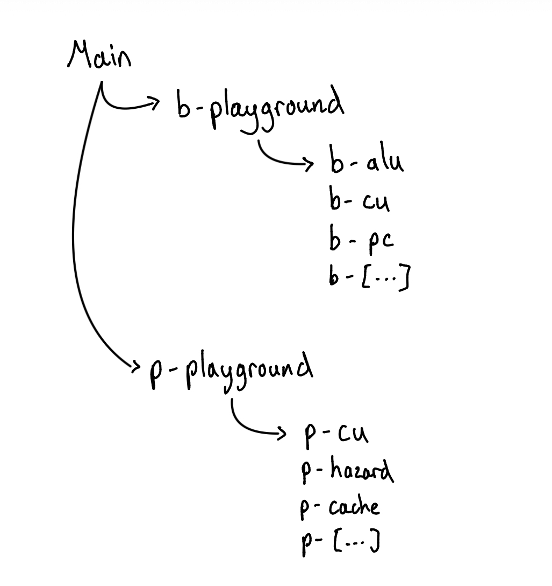

# Team 6 Pipelined RV32I

## Table of Contents:
1. [Overview](#overview)
2. [Group Details](#group-details)
3. [Work Split](#work-split)
4. [Repo Structure Explanation](#repo-structure)
5. [Test instructions](#test-instructions) 
6. [Evidence: F1 Simulation Lights](#working-simulation)

---
## Overview

This project incrementally develops a RISC-V RV32I processor, progressing from a minimal single-cycle design to a fully pipelined implementation with advanced features such as entire instruction set, multi-level caching, multiplication/division support, and branch prediction.
Each stage builds on the previous one, allowing functionality to be validated step-by-step while managing design complexity.

| RISC-V Progressive Stages | Explanation |
| :----  | :--- |
| **1. Basic Single Cycle RISCV**    | The implementation of the RISCV that completes all the instructions within a single cycle and has only the minimal instructions required to run the F1 simulaton (b-playground). |
| **2. Pipelined RISC-V**            | Introduced the pipeline registers inbetween sections to be able to speed up the processing speed. Also, created a hazard unit to manage the stalling, flushing and forwarding. |
| **3. Multi-Level Cache**           | Created a Level 1,2 and 3 Cache to prevent the OS from having to fetch from the memory and have a very local storage to use for reoccuring data. In reality, this should increase the processing speed but will seem to be slower on software simulation. |
| **4. Every Instruction**           | Went on to implement the logic for every possible instruction on RISCV so that we could theoretically run any assembly code fed into the instruction memory. |
| **5. Multiplication and Division** | Included multiplication and division units as an extra set of instructions to have available to use. These are external modules to the ALU.|
| **6. Branch Prediction**           | Implemented this an another module within our RISCV Processor to try predict when will branch and therefore prevent having to waste cycles when we have to flush after a branch instruction. |

## Group Details

| Name                     | CID      | GitHub          | Email             | Link to Personal Statement|
|--------------------------|----------|-----------------|-------------------|---------------------------|
| Lucca Butler-Cassar      | 02559782 | **lb1224-icl**  | lb1224@ic.ac.uk   | [Lucca's Statement](readme_statements/Lucca.md)
| Ryota Hosokawa           | 02591705 | **Ryota7hos1**  | rh1524@ic.ac.uk   | [Ryota's Statement](readme_statements/Ryota.md)
| Ethan Cann               | 02592695 | **EthanCann**   | ssc624@ic.ac.uk   | [Ethan's Statement](readme_statements/Ethan.md)
| Charlie Sampson          | 02596094 | **charliejsampson**  | cs2024@ic.ac.uk  | [Charlie's Statement](readme_statements/Charlie.md)

## Work Split 

| **Sections**            | **Lucca** | **Ryota** | **Ethan** | **Charlie** |
|-------------------------|:---------:|:---------:|:---------:|:-----------:|
| Program Counter         | ✔️        |           |           |             |
| Instruction Memory      | ✔️        |           | ✔️        |             |
| Data Memory             | ✔️        | ✔️       |           |             |
| Control Unit            |           |           | ✔️        |             |
| Register File           |           | ✔️        |           |             |
| Sign Extend             |           |           | ✔️        |             |
| ALU                     |           | ✔️        |           |             |
| Mult & Div Units        |           | ✔️        | ✔️        | ✔️         |
| Pipeline Registers      |           |           |           | ✔️          |
| Hazard Unit             |           |           |           | ✔️          |
| Branch Pred Unit        |           |  ✔️       |           |             |
| Cache                   | ✔️        |           |           |             |
| Muxes                   | ✔️        | ✔️        |           |             |
| Top Level Datapaths     | ✔️        | ✔️        | ✔️        | ✔️          |
| General Debugging (CPU) | ✔️        | ✔️        | ✔️        | ✔️          |

## Repo Structure 

### Branch Visualization:

The branches that are labelled:
-  `b-playground` is our foundation for building the **single cycle RISCV processor** without any pipelining or further extensions. It has sub branches: `b-` which is where everyone did their individual work to merge back to b-playground at the end.
-  `p-playground` is our foundation for building **pipelined RISCV processor** and also include the further progressing stages e.g. **branch prediction, multi-level cache...**. It has sub branches: `p-` which is once again where everyone did their individual work to merge back to p-playground at the end. There are a few branches that end in words like "safety" and "debug" which are used individually to try debug and solve code errors after having merged everything together.
- `main` is the head branch where our **best performing RISCV Processor** and all testing codes are available.

These `b-playground` and `p-playground` branches should have our working RISCV processor for the according stage and the `main` branch will have our final working processor with every implementation.

## Working Simulation 

### **Watch the Full Video:** [F1_SIMULATON_LIGHTS_VIDEO.mp4](tb/Simulation_Video/F1_SIM.mp4)

## Test Instructions

`CHARLIE DO HERE`

